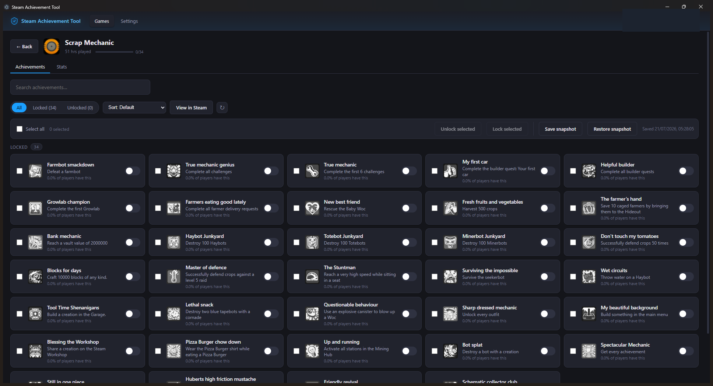

# Steam Achievement Tool — Downloads

A modern desktop tool for managing your Steam achievements and stats — unlock, lock, and bulk-edit achievements across your library, with global unlock percentages, DLC awareness, snapshots, and more.

## Download

Grab the latest build from the [Releases page](../../releases/latest):

- **`Steam.Achievement.Tool.Setup.1.0.0.exe`** — installer (recommended)
- **`Steam.Achievement.Tool.1.0.0.exe`** — portable, no install required

Windows only. Steam must be running while you use the tool.

## Getting a license

This tool requires a license tied to your email address. Licenses aren't self-serve — request one on Discord and it'll be issued to you directly.

**Discord: coming soon**

Once you have a license, open the app and enter the email address it was issued to. The app registers itself to your device automatically on first unlock.

## Using the tool

1. Install and launch the app.
2. Enter your license email when prompted.
3. In **Settings**, add your [Steam Web API key](https://steamcommunity.com/dev/apikey) and your SteamID64 (or Steam profile URL).
4. Pick a game from your library to view and edit its achievements and stats.
